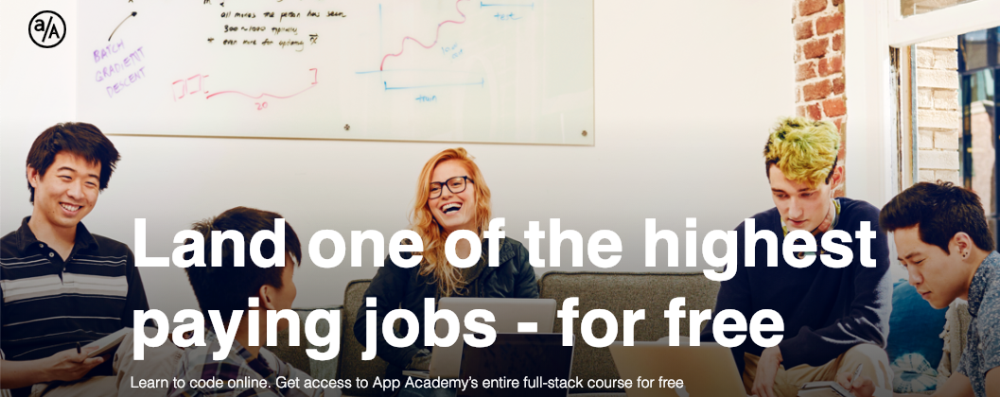

# Welcome to a/A Open

tl;dr: [click here to learn to code for free][open-url]

### Overview

With App Academy Open you’ll get free access to App Academy’s entire in-person full-stack curriculum, which has placed thousands of people in software development jobs. App Academy is ranked as the #1 coding bootcamp in the US and, since 2016, has placed more software developers at Google than UC Berkeley. On the Free plan you’ll get over 1,500 hours of material (readings, videos, projects), an interactive coding environment and community features like chat to keep you connected with thousands of prospective developers across the globe.

### How to Get Started

Navigate to [App Academy Open][open-url] and sign up for a free account. All you'll need to provide is your email address and name. You'll be redirected to our learning platform where you'll be starting your first lesson immediately.

The rest of the courses from our legendary Full-Stack curriculum are available to you from the moment you sign up. To switch, simply click the 'Course Outline' at the top of the page. The menu should have a 'Switch' button which will list all available courses.

[open-url]: https://open.appacademy.io/

### Free Courses

* Welcome to Coding
* Intro to Programming
* Alpha Curriculum
* Ruby
* SQL
* Rails
* JavaScript
* React
* Full Stack Project
* Job Search